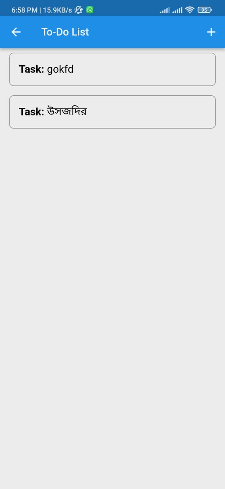

# Flutter To-Do List and Sensor Tracking App

## Overview
This Flutter application consists of two main features: a To-Do List manager and a Sensor Tracking module. The app allows users to create, manage, and track tasks, as well as monitor real-time data from device sensors.

## Features
### To-Do List
- **Main Screen**: Displays the number of completed and incomplete tasks.
- **Add Task**: Users can add new tasks.
- **Task Management**:
    - Click on a task to view and manage subtasks.
    - Each task can have multiple subtasks.
    - Users can set reminders and due dates for tasks.
    - Option to add notes for each task.

### Sensor Tracking
- **Sensor Data Monitoring**: Track and display real-time data from the device’s gyro and accelerometer sensors.
- **Alerts for Movement**: The app triggers alerts based on specific movement thresholds.

## Screenshots
<p align="center">
    # Home Screen
  
    # To-Do List
  
    # Sensor Tracking
  
</p>
<!--
### Home Screen

### To-Do List

### Sensor Tracking

-->

### Prerequisites
- Flutter SDK (latest version)
- Dart SDK (comes with Flutter)
- Android Studio / Visual Studio Code (optional, but recommended)

### APK FLie path
todo_list/build/app/outputs/flutter-apk

### Installation
1. Clone the repository:
   ```bash
   git clone https://github.com/Md-Rifat-Islam/To-Do-List-and-Sensor-Tracking-App-Flutter-.git
   
